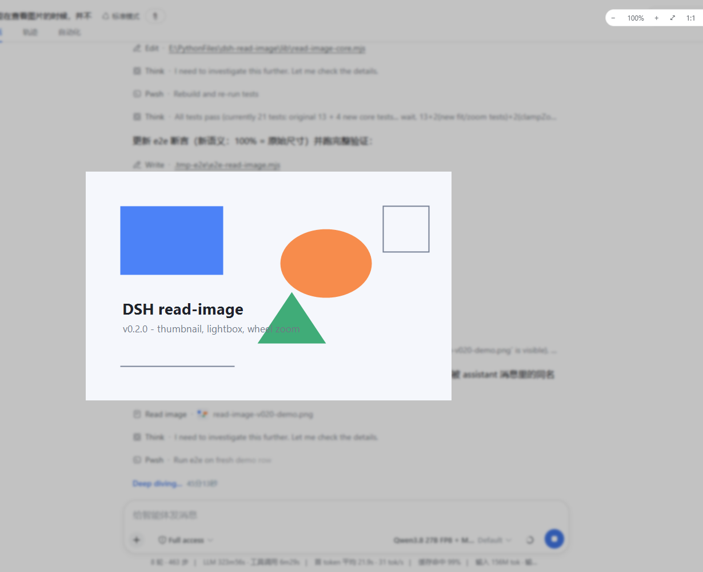
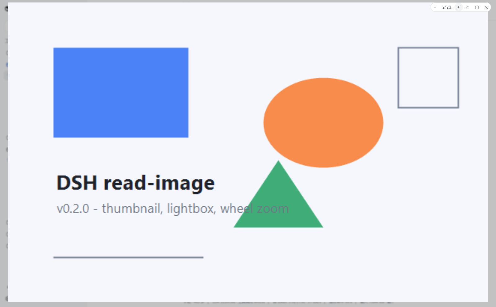

[中文](README.md)

# dsh-read-image-view

[](https://github.com/Yu-tao-Li/dsh-read-image-view/actions/workflows/ci.yml)
[](https://github.com/Yu-tao-Li/dsh-read-image-view/releases)
[](LICENSE)

[](https://github.com/Yu-tao-Li/dsh-read-image-view)

**Displays the images the `read_image` tool read, inside the [DeepSeek Harness](https://github.com/deepseek-ai/deepseek-harness) Web GUI conversation flow.** After the model calls `read_image`, the conversation shows a dedicated **Read image** row: the collapsed row already carries a **small thumbnail**, and clicking the thumbnail / the large frame opens an **in-page** original-image lightbox (mask + frosted backdrop) with **zoom buttons, mouse-wheel zoom, and 1:1 original size** — 100% means 1:1 original pixels, and zooming stays crisp (real-pixel rendering, not scale-up interpolation).

A pure client-side plugin (browser-only), zero runtime dependencies, no changes to DSH itself.

| ① Collapsed row: thumbnail by default (click → in-page lightbox) | ② Expanded row: 240px-long-edge frame + OUT metadata envelope |
|---|---|
|  |  |
| ③ In-page lightbox: 100% = original size; control bar − / % / + / fit / 1:1 / close | ④ Wheel- or button-zoomed to 242% (full-pixel rendering, no blur) |
|  |  |

## Background

The `read_image` tool persists its image into DSH's **content-addressed attachment store** (`$DSH_HOME/attachments/v1/objects/<sha256>`); the `tool/result` event carries only a durable `sha256:` reference plus metadata (`mediaType`/`width`/`height`/`bytes`/`name`). The Web GUI's generic tool row rendering flattened non-text content blocks to JSON — so users saw an attachment-reference JSON blob instead of the picture.

This plugin closes that gap: it extracts the attachment reference from the tool result, fetches the **original bytes** back through the gateway's existing `session.attachment` RPC (the same endpoint the runtime Session facade uses, same-origin, never re-compressed), and renders the thumbnail, the large frame, and the zoomable lightbox in the page.

## Features

- **Dedicated Read image row** — same chrome as the built-in Read row (browse icon, state dots, running sweep, expand/collapse).
- **Thumbnail by default** — a 20px thumbnail sits in the collapsed row, so the picture is visible without expanding; clicking it enlarges **in the page** (the conversation stays in place and the OS image viewer is never invoked — the path is plain text on purpose: the host `openFile` action was removed so the Windows Photos window can no longer pop up over the GUI).
- **In-page lightbox** — a body-portal fullscreen layer: design-system mask token (`--dsw-alias-bg-mask-1`) + frosted backdrop (`--dsw-mask-blur`, which is what makes it read as a modal in dark themes); closes on Esc / empty-area click / ✕; **repeatable, not one-shot** (thumbnail and frame re-open it any time).
- **Full-resolution zoom** — 100% = 1:1 original pixels (not "fit to viewport"); the img is sized in real pixels, so at ≥100% the browser re-rasterizes the original bitmap (crisp zoom) and below 100% it is a high-quality downsample; on open the image is fitted to the viewport but never upscaled past 100%.
- **Three ways to zoom** — **− / +** control-bar buttons (×/÷ 1.25), the **mouse wheel** (smooth exponential, clamped 10%–800%), and the **⤢ fit** / **1:1** buttons; drag pans while the displayed image overflows the stage.
- **Metadata envelope preserved** — the OUT section shows the `<path>/<type>/<content>` text (media type, pixel size, byte count) instead of attachment JSON noise.
- **Error paths unchanged** — failed calls (missing file, image-incapable model, …) carry no image part and render as ordinary error rows (red dot + error text); a failed frame load shows a retry control.
- **No widened trust boundary** — image bytes only flow through the `session.attachment` endpoint, which authorizes per session (the reference must appear in that session's durable log); the plugin performs no file I/O of its own.
- **Graceful yielding** — registers the `tool.call.toolview` key `read_image` at `priority: 100`: if a future first-party renderer takes the key at a lower priority, it wins and this plugin stays registered but unrendered, with no conflict.

## Install

```powershell
# From GitHub (--profile selects the profile; use web for the Web GUI)
dsh plugin --profile web add github:Yu-tao-Li/dsh-read-image-view
# Or a local directory
dsh plugin --profile web add file:\<path>\dsh-read-image-view
```

Restart `dsh web` (profile plugin sets assemble at boot). From then on, every model `read_image` expands to its picture in the conversation.

## How it works

```
DSH Web GUI (browser)
  │  tool.call.toolview key "read_image" → this plugin's ImageRow
  │  ├─ collapsed: Read image · <plain-text path> + 20px thumbnail (click → in-page lightbox)
  │  └─ expanded: ImageFrame (240px-long-edge frame, click → in-page lightbox) + OUT envelope
  │        │  load(attachment) → POST /api/session.attachment
  │        │  { type:"client-request", method:"session.attachment",
  │        │    payload:{ sessionId, attachmentId } }
  │        ▼
  │      gateway → attachment store (sha256 content-addressed)
  │        → { value:{ attachment, data(base64) } }
  │        │  base64 → Blob URL (original bytes, page-lifetime cache per (session, attachment))
  │        ▼
  │      thumbnail / frame / ZoomLightbox (react-dom portal to body,
  │      real-pixel sizing + mask/blur tokens + zoom control bar)
  ▼
shell-built-in modules: react / react-dom / dsh-client-ui-primitives (icons & state dots only)
```

The core logic (`lib/read-image-core.mjs`) is pure: content-part validation, RPC byte fetch (dependency-injected `fetch`, unit-testable in Node), cache keys, zoom/fit clamping (`clampZoomPct`/`fitZoomPct`), and label resolution. The browser bundle (`lib/client.js`) is generated by `scripts/build-client.mjs`, which inlines the core into `src/client-src.js`; CI checks the bundle stays in sync with its sources.

## Security and limitations

- **Read-only rendering** — the plugin only fetches and renders; no writes, no new network endpoints.
- **Session-authorized** — `session.attachment` serves only attachments referenced in that session's durable log; cross-session references are refused (`attachment-error`).
- **Memory** — Blob URLs are cached per (session, attachment) for the page lifetime (content-addressed, so repeated references fetch once); a page refresh releases them. Refresh to reclaim memory after very many large images.
- **Web GUI only** — the TUI and other surfaces are unaffected (tool-result data itself is unchanged).
- Depends on the shell-built-in `react` / `react-dom` / `dsh-client-ui-primitives` modules and the `image.*` locale keys (loading/retry/close labels, shipped with `dsh-web`); if upstream changes the `tool.call.toolview` slot contract or the module loader table, this needs a matching adaptation.
- Full-resolution semantics: 100% always means 1:1 original pixels; >100% is the browser upscaling the original bitmap (interpolated), as expected.

## Development

```
lib/read-image-core.mjs   core pure logic (unit-testable in Node)
src/client-src.js         browser bundle template (/*__READ_IMAGE_CORE__*/ placeholder)
scripts/build-client.mjs  build / --check (CI bundle-sync gate)
lib/client.js             built artifact (committed; no build authorization needed at install)
lib/index.js              no-op host half (loader entry)
cordis.patch.yml          profile patch layer (registers the loader entry)
test/read-image-core.test.mjs   unit tests (node --test)
test/e2e-read-image.mjs         real-browser e2e (headless Edge; writes e2e-shots/ screenshots)
docs/dev-notes.md         design decisions, debug notes
```

```powershell
npm run build    # regenerate lib/client.js
npm run check    # verify the bundle is in sync with src/ + core
npm test         # node --test (21 cases)
npm run e2e      # needs a running dsh web + playwright-core (devDependency) + system Edge
```

CI (`.github/workflows/ci.yml`) runs the bundle-sync check plus the unit tests on every push/PR; the e2e needs a live GUI, so it is a local regression script instead (the four README screenshots were produced by it).

## License

MIT, see [LICENSE](LICENSE).
