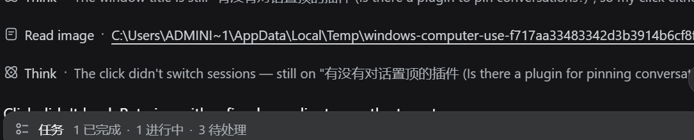

[English](README.en.md)

# dsh-read-image

[](https://github.com/Yu-tao-Li/dsh-read-image/actions/workflows/ci.yml)
[](https://github.com/Yu-tao-Li/dsh-read-image/releases)
[](LICENSE)

[](https://github.com/Yu-tao-Li/dsh-read-image)

**让 [DeepSeek Harness](https://github.com/deepseek-ai/deepseek-harness) 的 Web GUI 在对话里直接显示 `read_image` 读到的图片。** 模型调用 `read_image` 查看图片后，对话流中出现专用 **Read image** 行：展开即可看到图片本体（点击放大原图），下方保留媒体类型 / 尺寸 / 字节数的元数据信封；Inspect 详情面板同样渲染图片。

纯客户端插件（browser-only），零运行时依赖，不改 DSH 本体。

| ① 展开的 Read image 行：图片本体 + OUT 元数据信封 | ② 折叠行：`Read image · 文件路径`（路径可点击打开） |
|---|---|
|  |  |

## 背景

`read_image` 工具把读到的图片持久化进 DSH 的**内容寻址附件存储**（`$DSH_HOME/attachments/v1/objects/<sha256>`），`tool/result` 事件里只存一个 `sha256:` 引用 + 元数据（`mediaType`/`width`/`height`/`bytes`/`name`）。Web GUI 之前的工具行渲染把非文本内容块一律 JSON 化展示——用户看到的是一大段附件引用 JSON，而不是图片本身。

本插件补上这一环：从工具结果里提取附件引用，通过网关既有的 `session.attachment` RPC（与运行时 Session 门面同一端点，同源）取回字节，用 DSH 内置的 `ImageGallery` 图片原子组件渲染（加载占位、失败重试、点击 lightbox 放大原图全部复用官方实现）。

## 特性

- **专用 Read image 行**——与内置 Read 行同款外观（browse 图标、状态点、运行中扫描动画、展开/收起）；摘要为文件路径链接（相对会话工作区显示，点击走宿主 `openFile`）。
- **图片本体渲染**——`ImageGallery`/`MessageImage` 官方原子组件：单图 240px 长边自适应、点击打开原图 lightbox（Esc / 遮罩关闭）、加载失败显示重试按钮。
- **元数据信封保留**——OUT 区显示 `<path>/<type>/<content>` 文本（媒体类型、像素尺寸、字节数），不再出现附件 JSON 噪音。
- **Inspect 详情面板**——`conversation.details.tool` 槽位的 Output 区同样渲染图片 + 信封。
- **错误路径不变**——文件不存在 / 模型不支持图片等失败结果没有 image 内容块，行内按普通错误展示（红点 + 错误文本）。
- **安全边界不放宽**——图片字节只经 `session.attachment` 端点获取，该端点按会话授权（引用必须出现在该会话的持久日志中才放行）；插件本身不做任何文件 I/O。
- **优雅让位**——注册 `tool.call.toolview` 键位 `read_image` 时使用 `priority: 100`：若未来 DSH 内置 read_image 渲染（priority 更低），内置行自动胜出，本插件保持注册但不渲染，零冲突。

## 安装

```powershell
# 从 GitHub（--profile 指定装进哪个 profile；Web GUI 用 web）
dsh plugin --profile web add github:Yu-tao-Li/dsh-read-image
# 本地目录
dsh plugin --profile web add file:\<path>\dsh-read-image
```

重启 `dsh web` 生效（profile 插件集在启动时装配）。此后模型每次 `read_image`，对话里即可展开看原图。

## 工作原理

```
DSH Web GUI（浏览器）
  │  tool.call.toolview 键位 "read_image" → 本插件 ImageRow
  │  ├─ 折叠行：Read image · <path>（file link）
  │  └─ 展开：ImageGallery（官方原子组件）
  │        │  load(attachment) → POST /api/session.attachment
  │        │  { type:"client-request", method:"session.attachment",
  │        │    payload:{ sessionId, attachmentId } }
  │        ▼
  │      网关 → 附件存储（sha256 内容寻址）→ { value:{ attachment, data(base64) } }
  │        │  base64 → Blob URL（按 (session, attachment) 页面级缓存）
  │        ▼
  │       + OUT 元数据信封
  ▼
@deepseek-ai/dsh-client-ui-attachment（官方图片原子，shell 内置）
```

核心逻辑（`lib/read-image-core.mjs`）为纯函数：内容块校验、RPC 取字节（fetch 依赖注入，Node 可单测）、缓存键、标签解析。浏览器 bundle（`lib/client.js`）由 `scripts/build-client.mjs` 把核心内联进 `src/client-src.js` 生成，CI 校验 bundle 与源同步。

## 安全与限制

- **只读渲染**——插件只取图、只渲染，无任何写操作；不新增网络端点。
- **会话授权**——`session.attachment` 只放行该会话持久日志中引用过的附件；跨会话引用被拒（`attachment-error`）。
- **内存**——Blob URL 按 (session, 附件) 缓存于页面生命周期内（附件内容寻址，重复引用只取一次）；页面刷新即释放。大量超大图片场景下可自行刷新页面回收。
- **仅 Web GUI**——TUI / 其他表面不受影响（工具结果数据本身未变）。
- 依赖 DSH 内置的 `ImageGallery` 原子组件与 `image.*` 语言键（随 `dsh-web` 版本提供）；若上游调整了槽位契约（`tool.call.toolview`），需同步适配。

## 开发

```
lib/read-image-core.mjs   核心纯逻辑（Node 可单测）
src/client-src.js         浏览器 bundle 模板（/*__READ_IMAGE_CORE__*/ 占位）
scripts/build-client.mjs  构建 / --check（CI 校验 bundle 与源同步）
lib/client.js             构建产物（提交入库，免安装时构建授权）
lib/index.js              无操作宿主半边（loader 入口）
cordis.patch.yml          profile 补丁层（注册 loader 条目）
test/                     node --test 单元测试
docs/dev-notes.md         设计决策、调试记录
```

```powershell
npm run build    # 重新生成 lib/client.js
npm run check    # 校验 bundle 与 src/+core 同步
npm test         # node --test（13 例）
```

CI（`.github/workflows/ci.yml`）在每次 push/PR 跑 bundle 同步检查 + 单元测试。

## 许可

MIT，见 [LICENSE](LICENSE)。
